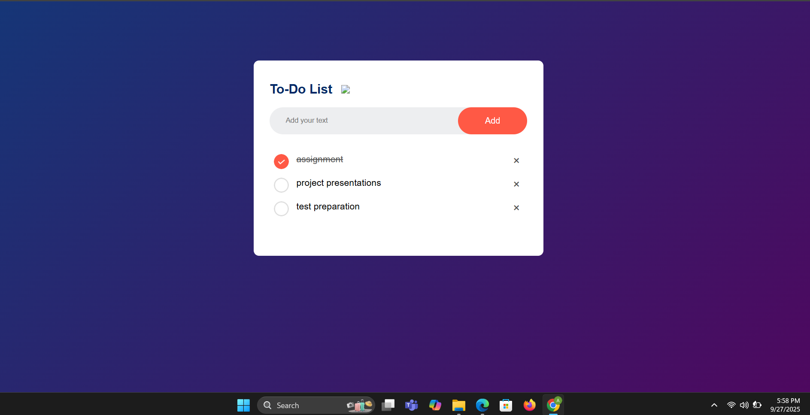

# To-Do List App

A simple To-Do list web application built using HTML, CSS, and optionally JavaScript. Users can add tasks, mark them as complete, and track daily tasks.

## Features
- Add new tasks
- Mark tasks as complete
- Clean and responsive design
- Simple, easy-to-use interface

## Demo
You can view the live app here:  
[Live Demo](https://adithya10707.github.io/To-do-list/)

## Screenshot
 

